Фазлыйнуров Артем Артурович БИВТ-26-6-3

# Лабораторная работа 1

## Задание № 1:

>- ввел данные строку и интеджер
>- через f строку соединил, чтобы можно было легко вывести переменные

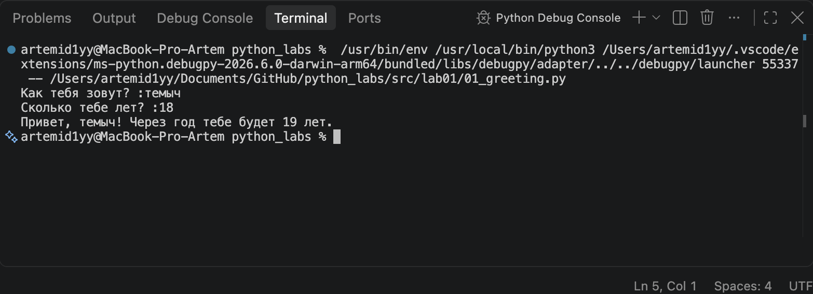

## Задание № 2:

>- ввел данные через float, так как могут быть и дробные числа(ссылаясь на пример)
>- заменил запятые на точку, так как питон принимает дробные только с точкой
(вдруг кто-то введет число с запятой)
>- вывел данные через f строку

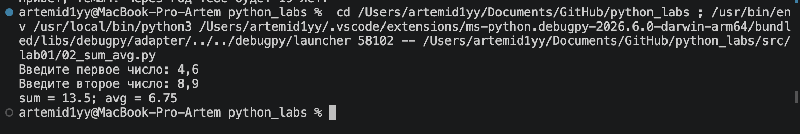

## Задание  № 3:

>- ввел данные 
>- написал форумулы, которые данны
>- вывел через f строку с тремя кавычками, чтобы переносить на другие строки код

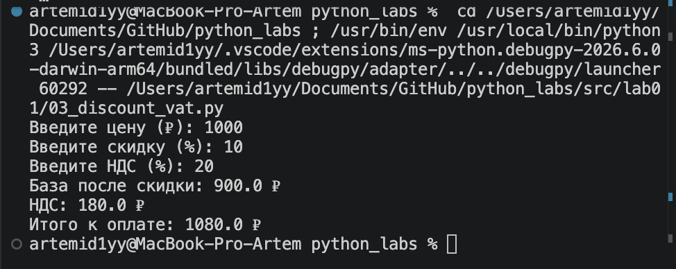

## Задание № 4:

>- ввел данные целочисленные
>- нашел часы путем деления нацело
>- нашел минуты путем остатка от деленния
>- 02d это означает миниумум 2 символа дополнить 
>- если меньше 2 то добавить 0

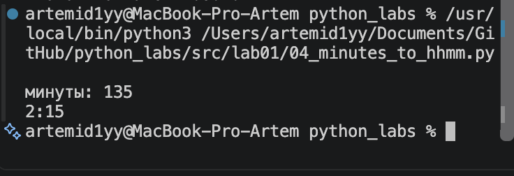


## Задание № 5:

> - ввел ФИО
> - разбил его на несколько частей и вернул в виде списка
> - вывел с помощью индексов списка

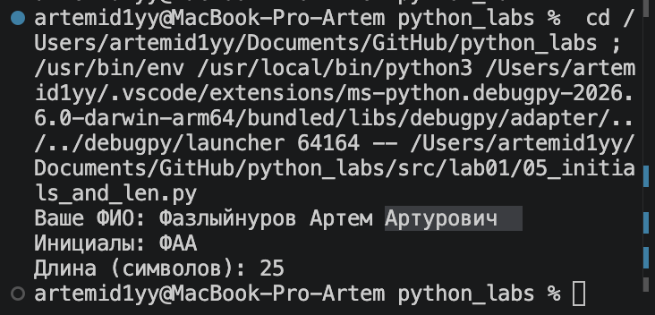


## Задание № 6:

>- посчитал кол-во участников
>- циклом прошелся по кол-ву участников
>- считал строку и разбил ее по пробелам на 4 части
>- инпут возвращает строку поэтому True и False будут тоже строчные

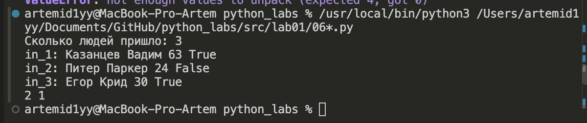


## Задание 7:
>- ввели строку
>- first ищет индекс первой заглавной буквы путем цикла с enumerate,
>- который позволяет идти и по индксу, и по символом.
>- isupper означает, что символ с заглавной буквы
>- next для того чтобы поиск не останавливался на первом символе,
>- а продолжал идти, пока не найдет заг. букву

>- тоже самое с second

>- потом прибавил 1 к second, так как нам нужен след символ(по условиб)

>- шаг находится путем нахождения разницы между second и first(step)
>- беру по модулю, потому что мы не знаем что больше

>- создаю список result

>- создаю бесконечный цикл, который останавливается только при break

>- сразу закидываю в result заглавную букву

>- условие, что уикл завершается, как только мы находим точку

>- прибавляем к индксу first шаг(step) и продолжаем наш поиск

>- в конце джоиню, чтобы склеить все найденные символы из списка result


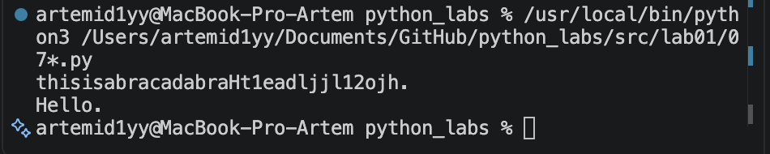


# Лабораторная работа № 2

## Задание № 1:

# 1
>- создал функцию
>- если список пуст, то raise полностью ложит функцию и возвращает ошибку
>- возвращаю кортеж, где мин элемент и макс элемент

# 2:
>- sorted - создает список
>- set - берет элементы единажды из списка
>- sorted до set т.к нужно вернуть список а не множество

# 3:
>- добавляем в список result каждый элемент списка или кортежа
>- если в списке сидит что-то другое то выбрасывается ошибка и функция падает

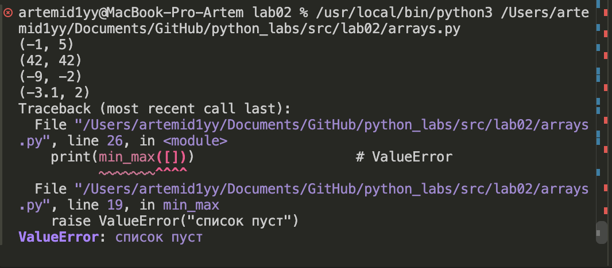
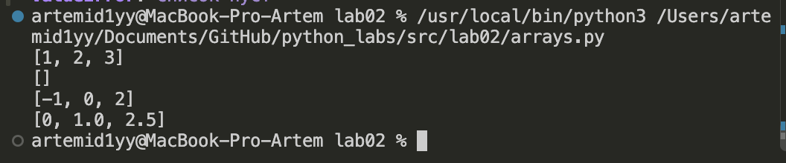
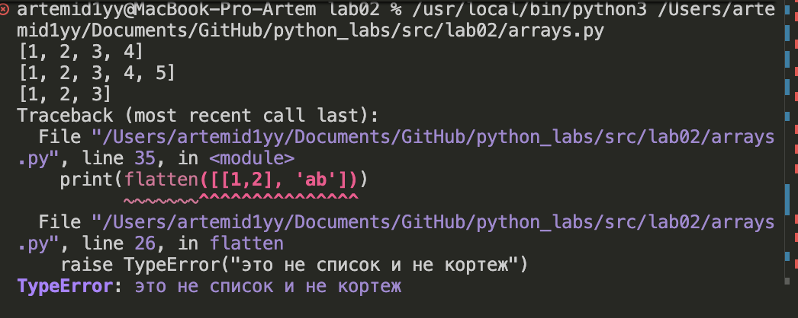


## Задание  №2:

>- сделал обущю функцию для проверки на рваность матрицы
>- если матрица пустая, то просто выбрасывается из функции
>- если матрица рваная, то возвращает ошибку

# 1:
>- проверяю на рваность 
>- если длина 0, то возвращаю пустой список
>- rows(cтроки) 
>- cols(столбцы)
>- иди циклом по столбцам 
>- создал список новой строки
>- теперь иду по строкам
>- и добавляю в новую строку поменянные индексы столбца и строки

# 2:
>- иди просто по спискам и скалдываю числа списков

# 3:
>- внешним циклом иду по номерам колонок,
>- а вложенным по значениям строкам
>- в total добавляю сумму по столбцам


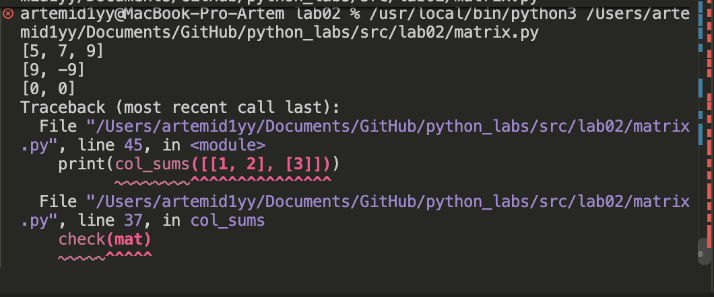
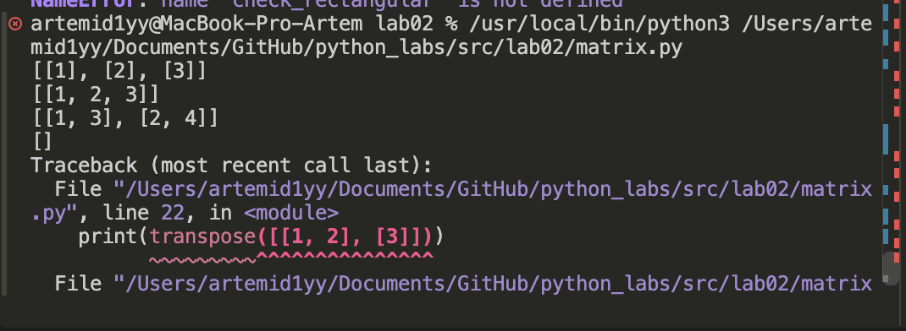
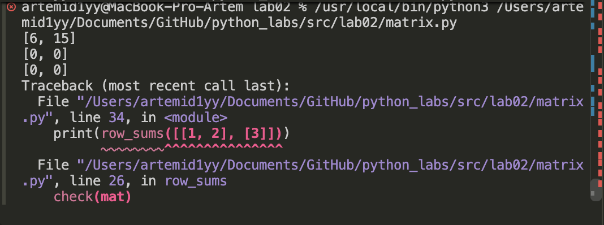


## Задание  №3:

>- сделал кортеж из трех элементов 

>- проверка на то что фио и группа должны быть строчными 

>- проверка на то что гпа интеджер или флоут

>- разбил фамилию по строкам в список с помощью split()

>- если фио меньше 2, то функция ложится

>- в group убираю лишние пробелы по краям

>- если group вообще не указана, то функция ложится

>- фамилия(surname) это первая часть списка parts (capitalize делает слово с заглавной буквы, остальные буквы строчные)

>- инициалы объединил из списка (upper сделал их заглавными буквами)


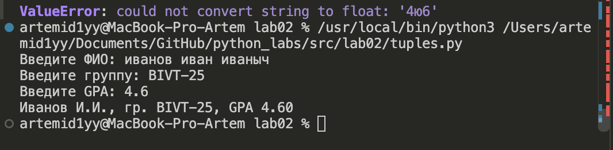


# Лабораторная работа № 3

## Задание 1

### normalize

>- создаем функцию normalize
>- text: str подсказка того, что должно вводится строчное значение
>- "*" дает понять, что после нее значения будут возвращаться только при обращении к ним(по умолчанию, если их не указывать они True)
>- если знаечние casefold = True, то мы переходим внутрь if(если не указано, то соответсвенно тоже переходим)
>- сама функция casefold приводит к нижнему регистру все
>- yo2e заменяет ё на е
>- re.sub() ищет в text все места совпадающие с шаблоном(re.sub(шаблон, замена, текст))
>- \t  символ табуляции
>- \r  возврат каретки
>- \n  новая строка
>- все это стоит в квадратных скобках, чтобы это воспринималась не как послдовательноть, а то, что может стоять любое из этого
>- re.sub() убирает пробелы, которых много( + в регулярке - это значит что пробел повторяется сколько угодно)
>- strip по краям убирает пробелы

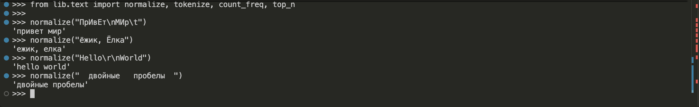

### tokenize

>- аргумент функции - строка
>- вернет список строк
>- re.findall() ищет все совпадения шаблона в тексте
>- \w+ ищет одну или более словесных символов подряд( то есть слово целиком)
>- ?: означает, что не нужно сохранять группу, которая пойдет далее отдельно в результат, а нужно -\w+   то есть нужно тире и далее следует слово или буква
>- '*' означает, что эта комбинация может повторяться 0 или более раз

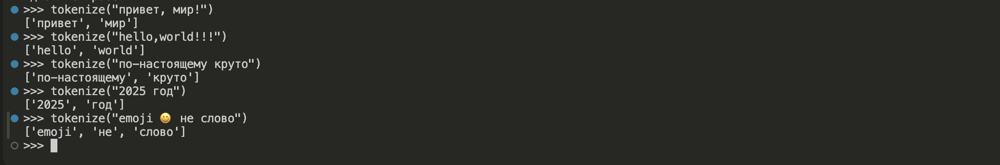

### count_freq

>- аргумент - список строк, ф. должна вернуть словарь с ключом строка, а аргументом число
>- перебираем каждый элемент в списке циклом
>- .get() - метод, который пытается найти занчение по ключу, если ключ уже есть в словаре, то вернет то знач что уже есть в словаре. Если значения нет, то вернет 0 вместо того, чтобы выдать ошибку
>- ну и соответсвенно прибавляем 1, чтобы увеличить счетчик

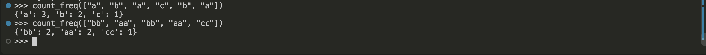

### top_n

>- подаем в аргемент  count_freq(словарь из стр или интеджер)
>- n дает понять, сколько слов мы хотим вообще получить при выводе 
>- вернет список кортежей 
>- .items() превращает из словаря пары в список кортежей(т.к sorted не умеет сортировать словарь)
>- sorted возвращает новый отсортированный список
>- key =   помогает сортировать так, как мы хотим
>- lambda это грубо говоря встроенная функция
>- item это один элемент из freq.items()
>- item[0] это первый элемент кортежа то есть слово
>- item[1] это второй эл то етсь кол-во
>- весь прикол, что я взял -item[1], так как нужно по убыванию(например 3 2 1 -> -3 -2 -1 то есть чем больше число с минусом, то оно будет как бы переворачивать список)

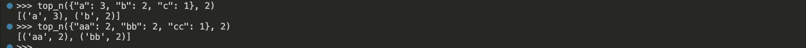

### Проверка тестов

>- тест-кейсы из задания записаны через assert в блоке if __name__ == "__main__"
>- assert молчит если проверка прошла и роняет программу если нет
>- при импорте модуля этот блок не выполняется, только при прямом запуске файла
>- команда: python3 src/lib/text.py

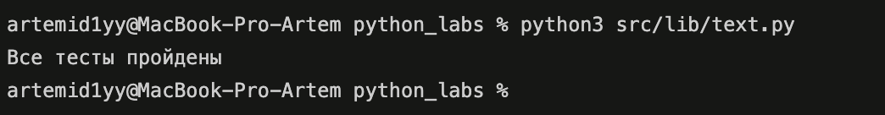


## Задание 2

### text_stats.py

>- скрипт читает весь текст из stdin до конца ввода (sys.stdin.read())
>- добавляю папку src в sys.path, иначе питон не находит lib
>- дальше по цепочке: normalize -> tokenize -> count_freq -> top_n
>- len(tokens) это всего слов, len(freq) это уникальных (ключи в словаре не повторяются)
>- топ-5 выводится в формате слово:количество

```
$ echo "Привет, мир! Привет!!!" | python3 src/lab03/text_stats.py
Всего слов: 3
Уникальных слов: 2
Топ-5:
привет:2
мир:1
```

### Задание со звездочкой

>- табличный режим включается переменной окружения TABLE_MODE=1
>- ширина столбца считается по самому длинному слову из топа
>- ljust() дополняет слово пробелами, чтобы все черточки встали в один столбец

```
$ echo "Привет, мир! Привет!!! по-настоящему 2025" | TABLE_MODE=1 python3 src/lab03/text_stats.py
Всего слов: 5
Уникальных слов: 4
Топ-5:
слово         | частота
-----------------------
привет        | 2
2025          | 1
мир           | 1
по-настоящему | 1
```

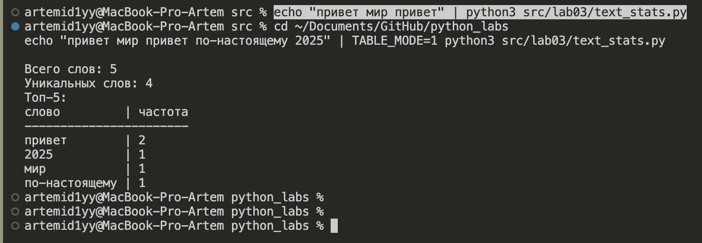
