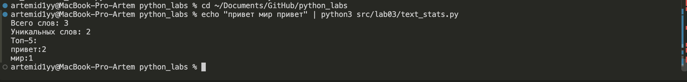

Фазлыйнуров Артем Артурович БИВТ-26-6-3

# Лабораторная работа № 3 — Тексты и частоты слов

## Задание A — `src/lib/text.py`

### normalize

>- `*` означает, что `casefold` и `yo2e` можно передать только по имени
>- `casefold()` приводит к нижнему регистру корректнее, чем `lower()`, для Юникода
>- `yo2e` склеивает `ё` и `е`, иначе «ёжик» и «ежик» считались бы разными словами
>- `re.sub(шаблон, замена, текст)` ищет в тексте все совпадения и заменяет их
>- `\t` — табуляция, `\r` — возврат каретки, `\n` — новая строка;
>  всё это в квадратных скобках, чтобы совпадал любой из символов, а не последовательность
>- `' +'` — один и более пробелов подряд, схлопываем в один
>- `strip()` убирает пробелы по краям


### tokenize

>- `re.findall()` ищет все совпадения шаблона в тексте и возвращает список
>- `\w+` — одна или более букв/цифр/подчёркиваний подряд, то есть слово целиком
>- `(?:...)` — группа без сохранения: она нужна только для повторения, в результат отдельно не попадает
>- `-\w+` — дефис и следующая за ним часть слова, поэтому `по-настоящему` остаётся одним токеном
>- `*` — эта комбинация может повторяться 0 или более раз
>- всё, что не подходит под `\w` (знаки препинания, эмодзи, длинное тире), становится разделителем


### count_freq

>- принимает список строк, возвращает словарь «слово → количество»
>- перебираем каждый токен циклом
>- `.get()` ищет значение по ключу; если ключа ещё нет, вернёт `0` вместо ошибки
>- прибавляем 1, чтобы увеличить счётчик


### top_n

>- на вход словарь из `count_freq`, `n` — сколько слов вернуть
>- `.items()` превращает пары словаря в список кортежей (`sorted` не сортирует словарь напрямую)
>- `key=` задаёт, по чему сортировать
>- `lambda` — короткая безымянная функция, `item` — один элемент из `freq.items()`
>- `item[0]` — слово, `item[1]` — количество
>- `-item[1]` даёт сортировку по убыванию частоты: чем больше число, тем «меньше» оно с минусом
>- при равной частоте сортировка идёт по `item[0]`, то есть по алфавиту
>- `[:n]` — берём первые `n` пар


### Проверка тест-кейсов

Контрольные мини-тесты из задания записаны через `assert` в блоке
`if __name__ == "__main__"`, поэтому при импорте модуля они не выполняются.
Запускаются отдельной командой:

```
$ python3 src/lib/text.py
Все тесты пройдены
```

`assert` молчит, когда проверка прошла, и роняет программу с `AssertionError`,
когда нет. Надпись печатается последней строкой — значит до неё дошло
выполнение и **все** тест-кейсы из задания прошли.


## Задание Б — `src/lab03/text_stats.py`

Скрипт читает **весь ввод до EOF** (а не одну строку), нормализует его,
токенизирует и печатает статистику.

```python
import os
import sys

# добавляем папку src/ в пути поиска модулей, чтобы работал импорт lib.text
# при запуске скрипта из любой директории
SRC_DIR = os.path.dirname(os.path.dirname(os.path.abspath(__file__)))
sys.path.append(SRC_DIR)

from lib.text import normalize, tokenize, count_freq, top_n


def print_table(items: list[tuple[str, int]]) -> None:
    if not items:
        return
    max_word_len = max(len(word) for word, _ in items)
    header = f"{'слово'.ljust(max_word_len)} | частота"
    print(header)
    print('-' * len(header))
    for word, count in items:
        print(f"{word.ljust(max_word_len)} | {count}")


def main() -> None:
    raw_text = sys.stdin.read()

    normalized = normalize(raw_text)
    tokens = tokenize(normalized)
    freq = count_freq(tokens)
    top5 = top_n(freq, 5)

    print(f"Всего слов: {len(tokens)}")
    print(f"Уникальных слов: {len(freq)}")
    print("Топ-5:")

    # табличный режим включается переменной окружения TABLE_MODE=1
    table_mode = os.environ.get("TABLE_MODE") == "1"

    if table_mode:
        print_table(top5)
    else:
        for word, count in top5:
            print(f"{word}:{count}")


if __name__ == "__main__":
    main()
```

>- `sys.stdin.read()` читает весь ввод целиком, до EOF 
>- `SRC_DIR` — путь к папке `src/`; без него Python при запуске
>  `python3 src/lab03/text_stats.py` видит только папку `lab03` и не находит `lib`
>- `len(tokens)` — всего слов, `len(freq)` — уникальных (ключи словаря не повторяются)
>- `ljust()` дополняет слово пробелами до нужной ширины, чтобы столбцы таблицы совпали


### ★ Табличный режим

Включается переменной окружения `TABLE_MODE=1`, ширина столбца «слово»
считается по самому длинному слову из топа.

```
$ echo "Привет, мир! Привет!!! по-настоящему 2025" | TABLE_MODE=1 python3 src/lab03/text_stats.py
Всего слов: 5
Уникальных слов: 4
Топ-5:
слово         | частота
-----------------------
привет        | 2
2025          | 1
мир           | 1
по-настоящему | 1
```


