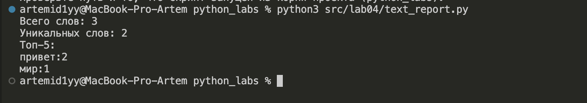
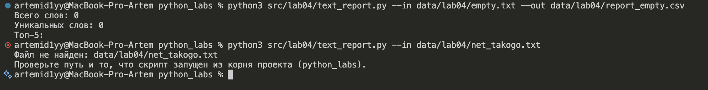
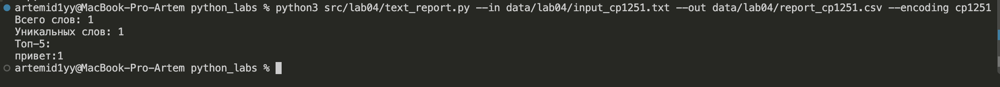

Фазлыйнуров Артем Артурович БИВТ-26-6-3

# Лабораторная работа № 4 — Файлы: TXT/CSV и отчёты по текстовой статистике

## Структура

```
src/
├─ lib/
│  └─ text.py             # из ЛР3, переиспользуется без изменений
└─ lab04/
   ├─ io_txt_csv.py       # задание A: read_text / write_csv / ensure_parent_dir
   ├─ text_report.py      # задание Б: отчёт в CSV + резюме в консоль
   └─ README.md
data/lab04/
├─ input.txt              # основной вход (тест-кейс A)
├─ empty.txt              # пустой вход (тест-кейс B)
├─ input_cp1251.txt       # вход в кодировке cp1251 (тест-кейс C)
└─ report.csv             # результат базового запуска
```

Ввод/вывод и логика разделены намеренно: `io_txt_csv.py` только читает и пишет
файлы, подсчётом частот занимается `lib/text.py` из ЛР3, а `text_report.py`
связывает их и решает, что показать пользователю.

---

## Задание A — `src/lab04/io_txt_csv.py`

### read_text

>- принимает путь к файлу и кодировку, возвращает всё содержимое одной строкой
>- кодировка по умолчанию utf-8, другую передают параметром: `encoding="cp1251"`
>- пустой файл даёт пустую строку, без всяких ошибок
>- `FileNotFoundError` и `UnicodeDecodeError` не перехватываются и всплывают наверх:
>  модуль не знает, как их правильно показать пользователю, это дело скрипта
>- файл читается целиком в память. Для учебных текстов это нормально,
>  но в реальной задаче большие файлы читают построчно (`for line in f`),
>  чтобы не держать весь объём разом

### write_csv

>- создаёт или перезаписывает CSV с разделителем-запятой
>- если передан `header`, он пишется первой строкой
>- перед записью проверяет, что все строки одной длины, иначе `ValueError`
>  с указанием номера проблемной строки — рваный CSV лучше не создавать вовсе
>- файл открывается с `newline=""`: модуль `csv` сам ставит перевод строки,
>  и без этого параметра в Windows между строками появлялись бы пустые
>- кодировка записи всегда utf-8, указана явно

### ensure_parent_dir

>- создаёт папки на пути к файлу, если их ещё нет
>- нужен потому, что `open` умеет создать файл, но не папку под ним:
>  без этого запуск с `--out data/новая_папка/report.csv` падал бы
>- `parents=True` создаёт всю цепочку папок, `exist_ok=True` не ругается,
>  если папка уже на месте

---

## Задание Б — `src/lab04/text_report.py`

Скрипт читает текстовый файл, считает частоты слов через `lib/text.py`,
сохраняет таблицу в CSV и печатает резюме в консоль.

### Команды запуска

Все команды выполняются **из корня проекта** (`python_labs`), потому что пути
по умолчанию записаны относительно него.

Базовый запуск — читает `data/lab04/input.txt`, пишет `data/lab04/report.csv`:

```
python3 src/lab04/text_report.py
```

Со своими путями:

```
python3 src/lab04/text_report.py --in data/lab04/input.txt --out data/lab04/report.csv
```

С другой кодировкой входного файла:

```
python3 src/lab04/text_report.py --in data/lab04/input_cp1251.txt --encoding cp1251
```

Справка по всем параметрам:

```
python3 src/lab04/text_report.py --help
```

### Что делает скрипт

>- пути принимаются через `argparse`: `--in`, `--out`, `--encoding`,
>  у каждого есть значение по умолчанию, так что запуск без аргументов тоже работает
>- текст прогоняется по цепочке из ЛР3: `normalize` → `tokenize` → `count_freq`
>- для CSV берётся `top_n(freq, len(freq))` — та же функция, что и для топ-5,
>  но с числом слов вместо 5. Она уже сортирует по `count` вниз и по слову вверх,
>  то есть ровно так, как требует задание, поэтому отдельная сортировка не нужна
>- перед записью вызывается `ensure_parent_dir`, чтобы папка точно существовала
>- в консоль печатаются три строки резюме и топ-5 в формате `слово:количество`

---

## Кодировки

Вход читается в utf-8, если не сказано иное. Для файла в другой кодировке
передаётся флаг:

```
python3 src/lab04/text_report.py --in data/lab04/input_cp1251.txt --encoding cp1251
```

Если кодировка не подходит, `read_text` поднимает `UnicodeDecodeError`,
а скрипт перехватывает её и печатает подсказку вместо трассировки:

```
Файл data/lab04/input_cp1251.txt не читается в кодировке utf-8.
Укажите подходящую, например: --encoding cp1251
```

CSV-отчёт **всегда** пишется в utf-8, независимо от кодировки входа.
Кодировка указана явно при открытии файла, на системную не полагаемся.

---

## Политика для пустого входа

Выбрано: **только заголовок**.

Если входной файл пуст, токенов не будет, и в `report.csv` попадёт
единственная строка `word,count`. Файл остаётся валидным CSV, и программа,
которая его прочитает, увидит таблицу с нулём строк, а не сломается
на пустом файле.

Консоль при этом показывает нули и пустой топ:

```
Всего слов: 0
Уникальных слов: 0
Топ-5:
```

## Если входного файла нет

Скрипт печатает сообщение в поток ошибок и завершается с кодом возврата **1**:

```
Файл не найден: data/lab04/net_takogo.txt
Проверьте путь и то, что скрипт запущен из корня проекта (python_labs).
```

Трассировка не показывается — для пользователя она бесполезна. Ненулевой код
возврата нужен, чтобы об ошибке узнал и тот, кто запускает скрипт из другого
скрипта, а не глазами.

---

## Тест-кейсы

### A. Один файл (база)

Вход `data/lab04/input.txt`:

```
Привет, мир! Привет!!!
```

Команда и вывод:

```
$ python3 src/lab04/text_report.py
Всего слов: 3
Уникальных слов: 2
Топ-5:
привет:2
мир:1
```

Полученный `data/lab04/report.csv`:

```
word,count
привет,2
мир,1
```



### B. Пустой файл

```
$ python3 src/lab04/text_report.py --in data/lab04/empty.txt --out data/lab04/report_empty.csv
Всего слов: 0
Уникальных слов: 0
Топ-5:
```

`report_empty.csv` содержит только заголовок:

```
word,count
```



### C. Кодировка cp1251

Файл `data/lab04/input_cp1251.txt` сохранён в cp1251 и содержит слово `Привет`.

Без флага скрипт честно сообщает о проблеме:

```
$ python3 src/lab04/text_report.py --in data/lab04/input_cp1251.txt --out data/lab04/report_cp1251.csv
Файл data/lab04/input_cp1251.txt не читается в кодировке utf-8.
Укажите подходящую, например: --encoding cp1251
```

С флагом читается корректно:

```
$ python3 src/lab04/text_report.py --in data/lab04/input_cp1251.txt --out data/lab04/report_cp1251.csv --encoding cp1251
Всего слов: 1
Уникальных слов: 1
Топ-5:
привет:1
```

`report_cp1251.csv`:

```
word,count
привет,1
```



### D. Проверки самого модуля

Мини-тесты из методички и проверка рваной таблицы:

```
$ python3 -c "
import sys; sys.path.insert(0, 'src/lab04')
from io_txt_csv import read_text, write_csv
print(repr(read_text('data/lab04/input.txt')))
write_csv([('word','count'),('test',3)], 'data/lab04/check.csv')
try:
    write_csv([('a', 1), ('b', 2, 3)], 'data/lab04/ragged.csv')
except ValueError as e:
    print('ValueError:', e)
"
'Привет, мир! Привет!!!\n'
ValueError: строка 2 имеет длину 3, а первая строка — 2
```


